# TwintopInsanityBar Architecture Diagram

This document illustrates the system architecture of the TwintopInsanityBar addon using Shadow Priest as the example specialization.

## System Overview

```mermaid
flowchart TB
    subgraph "🔄 Initialization Flow"
        A["🎮 PLAYER_SPECIALIZATION_CHANGED<br/>or Addon Load"] --> B["SwitchSpec()"]
        B --> C["FillSpellData_Shadow()"]
        B --> D["LoadFromSpecializationCache()"]
        B --> E["Assign RefreshLookupData_Shadow<br/>to TRB.Functions.RefreshLookupData"]
        B --> F["EventRegistration()"]
        F --> G["Character:EventRegistration()"]
        G --> H["📡 Register WoW Events"]
        G --> I["Enable timerFrame OnUpdate"]
        B --> J["ConstructResourceBar()"]
        J --> K["Create Threshold Frames"]
        J --> L["Bar:ConstructBarGroups()"]
    end

    subgraph "💾 Data Stores"
        DS1[("snapshotData<br/>• attributes.resource<br/>• attributes.mana<br/>• snapshots[spellId].buff<br/>• casting")]
        DS2[("lookup<br/>• $insanity → '|cFF..150|r'<br/>• $vfTime → '|cFF..12.5|r'")]
        DS3[("lookupLogic<br/>• $insanity → 150<br/>• $vfTime → 12.5")]
        DS4[("specCache.shadow<br/>• talents<br/>• settings<br/>• spellsData")]
        DS5[("barGroups<br/>• primary (Insanity)<br/>• mana<br/>• health")]
    end

    subgraph "📡 WoW Event Handlers"
        EV1["UNIT_POWER_UPDATE"] --> UP1["UpdateResourceValues()"]
        UP1 -->|"Write Insanity"| DS1
        EV2["UNIT_AURA"] --> AU1["AuraUpdateEvent()"]
        AU1 -->|"Update buffs/debuffs"| DS1
        EV3["UNIT_SPELLCAST_*"] --> SC1["SpellCastEvent()"]
        SC1 --> SC2["Class:SpellCast()"]
        SC2 -->|"Track casting"| DS1
        EV4["PLAYER_REGEN_*"] --> CB1["Combat State Change"]
        CB1 --> VIS["Bar Visibility Check"]
    end

    subgraph "⏱️ Timer Update Cycle (~0.05s)"
        TF["timerFrame:onUpdate()"] --> TR["TriggerResourceBarUpdates()"]
        TR --> UR["UpdateResourceBar()"]
        UR --> US["UpdateSnapshot_Shadow()"]
        US -->|"Refresh buff timers"| DS1
        UR --> HRB["HideResourceBar()"]
        HRB -->|"Check isTracking"| DS1
        UR --> UBC["Update Bar Value & Thresholds"]
        UR --> URBT["BarText:UpdateResourceBarText()"]
    end

    subgraph "🔁 Lookup Data Refresh"
        URBT --> RLDB["RefreshLookupDataBase()"]
        RLDB -->|"Stats, Health, GCD"| DS2
        RLDB -->|"Raw values"| DS3
        URBT --> RLD["RefreshLookupData_Shadow()"]
        RLD -->|"Read resource, buffs"| DS1
        RLD -->|"Formatted strings"| DS2
        RLD -->|"Raw numbers"| DS3
    end

    subgraph "🎨 Bar Rendering"
        UBC --> BN["BarNode:SetValue()"]
        BN --> RF["ResourceFrame visual update"]
        UBC --> TH["Threshold:AdjustDisplay()"]
        TH --> THF["Threshold line visibility"]
    end

    subgraph "📝 Bar Text Rendering"
        URBT --> PT["Parse Bar Text Strings"]
        PT -->|"Replace $variables"| DS2
        PT -->|"Evaluate conditionals"| DS3
        PT --> TFR["Update textFrames"]
    end

    %% Cross-subgraph connections
    D --> DS4
    DS4 -->|"Load snapshotData"| DS1
    L --> DS5
    HRB -->|"Show/Hide"| DS5
```

## Key Data Flow Loops

| Loop | Path | Purpose |
|------|------|---------|
| **Event → Snapshot** | `UNIT_POWER_UPDATE` → `UpdateResourceValues()` → `snapshotData` | Captures Insanity changes from WoW API |
| **Snapshot → Lookup** | `RefreshLookupData_Shadow()` reads `snapshotData` → writes to `lookup` + `lookupLogic` | Transforms raw data into formatted bar text variables |
| **Timer → Full Cycle** | `timerFrame:onUpdate` → `TriggerResourceBarUpdates` → `UpdateResourceBar` → back to waiting | Continuous polling drives all UI updates |
| **Lookup → Bar Text** | `lookup` table → `UpdateResourceBarText()` → `textFrames` | Replaces `$insanity` with colored value strings |

## Data Store Descriptions

### `TRB.Data.snapshotData`
The central state object containing all tracked information:
- `attributes.resource` - Current Insanity value (raw from API)
- `attributes.resourceModified` - Normalized resource value for display
- `attributes.mana` / `attributes.manaMax` - Mana tracking for Shadow
- `snapshots[spellId].buff` - Buff/debuff state per spell
- `casting` - Current spellcast information

### `TRB.Data.lookup`
String-formatted values for bar text display:
- Keys like `$insanity`, `$vfTime`, `$mana`
- Values are color-formatted strings: `"|cFF00FF00150|r"`

### `TRB.Data.lookupLogic`
Raw numeric values for conditional evaluation:
- Same keys as `lookup`
- Values are raw numbers: `150`, `12.5`

### `TRB.Data.specCache`
Per-specialization cached data:
- `talents` - Current talent configuration
- `settings` - Merged user settings
- `spellsData` - Spell definitions and tracking
- `snapshotData` - Spec-specific snapshot reference

### `TRB.Frames.barGroups`
OOP-based bar frame hierarchy:
- `primary` - Main resource bar (Insanity)
- `mana` - Secondary mana bar
- `health` - Health bar

## Event Registration

When Shadow Priest is active, these WoW events are registered:

| Event | Handler | Updates |
|-------|---------|---------|
| `UNIT_POWER_UPDATE` | `UpdateResourceValues()` | `snapshotData.attributes.resource` |
| `UNIT_AURA` | `AuraUpdateEvent()` | Buff/debuff snapshots |
| `UNIT_SPELLCAST_START/STOP/SUCCEEDED` | `SpellCastEvent()` | `snapshotData.casting` |
| `PLAYER_REGEN_DISABLED/ENABLED` | Combat state handler | Bar visibility |
| `COMBAT_LOG_EVENT_UNFILTERED` | Combat log parser | DoT tracking, damage events |

## Update Cycle

The addon uses a hybrid event-driven + polling architecture:

1. **Event-Driven**: WoW events immediately update `snapshotData`
2. **Polling**: `timerFrame:onUpdate()` runs every ~0.05s to refresh the UI
3. **Lookup Refresh**: Each update cycle regenerates `lookup` and `lookupLogic` tables
4. **Bar Rendering**: Bar values and text are updated from the lookup tables

This ensures the UI stays responsive while avoiding excessive event handler complexity.
