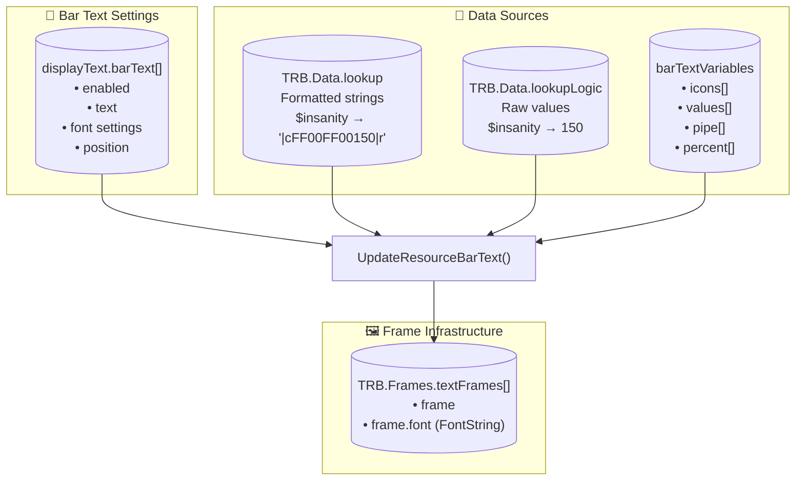
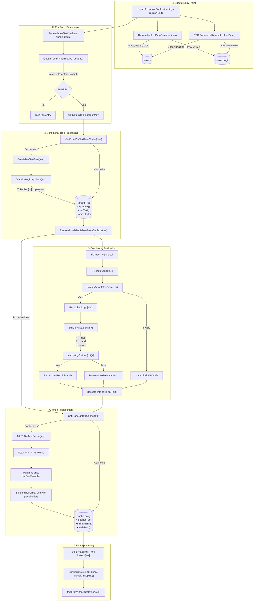
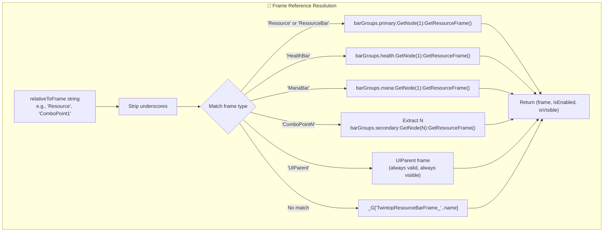
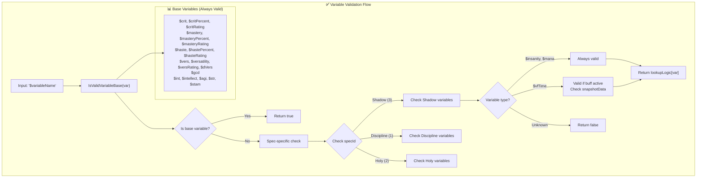
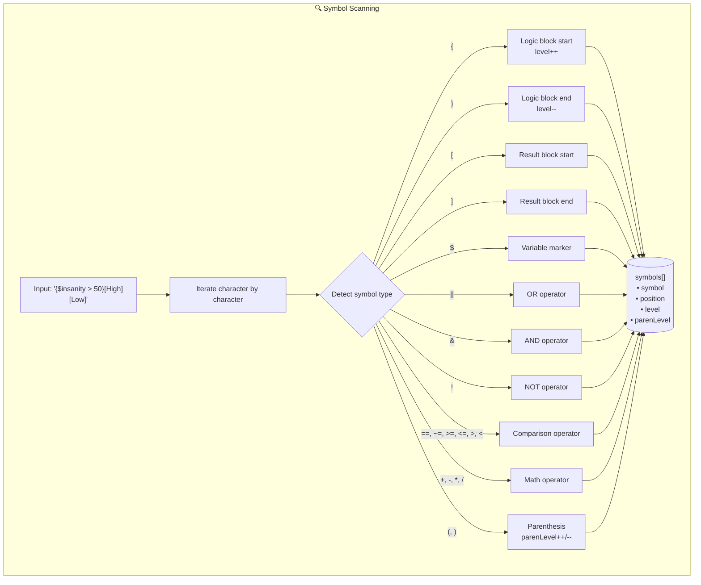
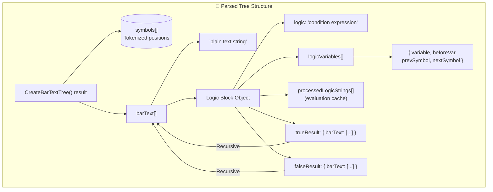
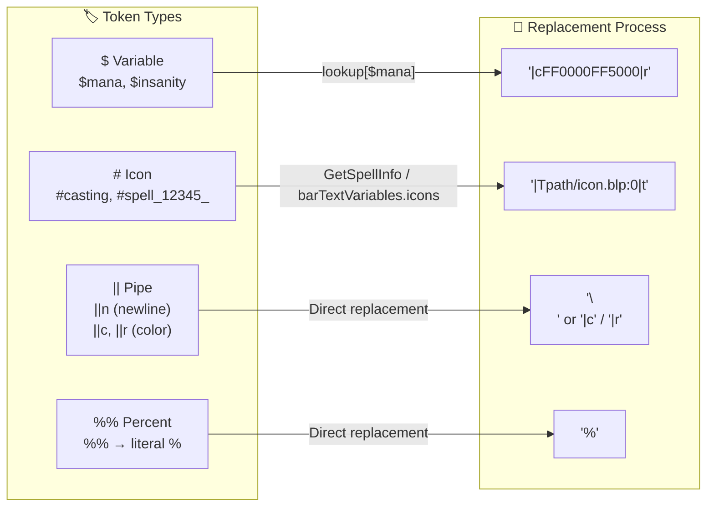
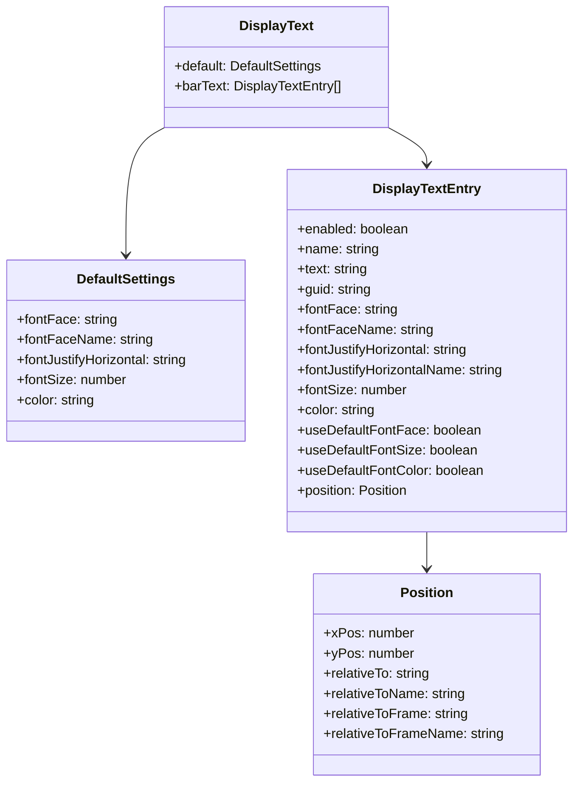
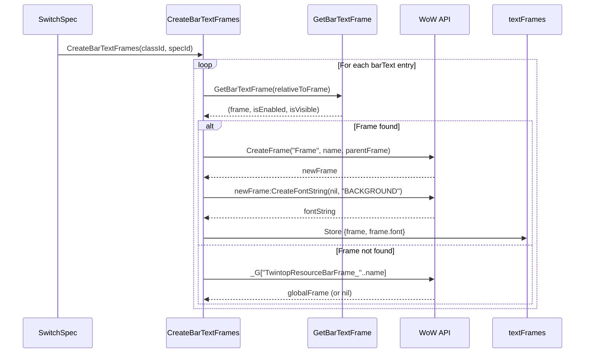

# TwintopInsanityBar Bar Text Processing System

This document provides a detailed diagram of how bar text processing works in the TwintopInsanityBar addon.

## High-Level Overview

## Complete Processing Flow

## Frame Resolution: `GetBarTextFrame()`

## Variable Validation: `IsValidVariableForSpec()`

## Conditional Logic Tokenization: `ScanForLogicSymbols()`

## Conditional Tree Structure

## Token Types and Replacement

## Cache Structure

```mermaid
flowchart TB
    subgraph "💾 Caching Layers"
        INPUT2["Raw bar text string"]
        
        INPUT2 --> TREECACHE{"barTextTree cache?"}
        TREECACHE -->|"Miss"| PARSETREE["Parse with CreateBarTextTree()"]
        PARSETREE --> STORETREE["Store in TRB.Data.cache.barTextTree[text]"]
        TREECACHE -->|"Hit"| USETREE["Use cached tree"]
        
        STORETREE --> EVALUATE["Evaluate conditionals"]
        USETREE --> EVALUATE
        
        EVALUATE --> PROCESSED2["Processed text (conditionals resolved)"]
        
        PROCESSED2 --> TEXTCACHE{"barText cache?"}
        TEXTCACHE -->|"Miss"| PARSETEXT["Parse with AddToBarTextCache()"]
        PARSETEXT --> STORETEXT["Store in TRB.Data.cache.barText[text]"]
        TEXTCACHE -->|"Hit"| USETEXT["Use cached format"]
        
        STORETEXT --> CACHEENTRY
        USETEXT --> CACHEENTRY
        
        CACHEENTRY[("Cache Entry<br/>• cleanedText<br/>• stringFormat<br/>• variables[]")]
        
        CACHEENTRY --> FORMAT["string.format(stringFormat, ...)"]
    end
```

## Bar Text Settings Structure

## Text Frame Creation

## Key Function Reference

| Function | File | Purpose |
|----------|------|---------|
| `UpdateResourceBarText()` | Functions/BarText.lua | Main entry point, orchestrates full update |
| `RefreshLookupDataBase()` | Functions/BarText.lua | Populates base stats in lookup tables |
| `GetReturnText()` | Functions/BarText.lua | Processes conditionals and returns final text |
| `CreateBarTextTree()` | Functions/BarText.lua | Parses text into conditional tree structure |
| `ScanForLogicSymbols()` | Functions/BarText.lua | Tokenizes symbols for parsing |
| `RemoveInvalidVariablesFromBarText()` | Functions/BarText.lua | Evaluates conditionals, returns processed text |
| `AddToBarTextCache()` | Functions/BarText.lua | Tokenizes variables, creates format string |
| `GetFromBarTextCache()` | Functions/BarText.lua | Retrieves cached parse result |
| `GetFromBarTextTreeCache()` | Functions/BarText.lua | Retrieves cached tree structure |
| `IsValidVariableForSpec()` | ClassModules/*.lua | Validates variable for current spec |
| `IsValidVariableBase()` | Functions/BarText.lua | Validates common base variables |
| `GetBarTextFrame()` | ClassModules/*.lua | Resolves frame reference to actual Frame |
| `CreateBarTextFrames()` | Functions/BarText.lua | Creates text frame infrastructure |

## Data Store Summary

| Store | Location | Purpose |
|-------|----------|---------|
| `TRB.Data.lookup` | Global | Formatted colored strings for display |
| `TRB.Data.lookupLogic` | Global | Raw numeric values for conditional evaluation |
| `TRB.Data.barTextVariables` | Global | Valid variable definitions per spec |
| `TRB.Data.cache.barText` | Global | Cached parsed text with format strings |
| `TRB.Data.cache.barTextTree` | Global | Cached conditional tree structures |
| `TRB.Data.cache.symbols` | Global | Cached tokenized symbol positions |
| `TRB.Frames.textFrames` | Global | Array of text Frame objects |
| `settings.displayText.barText` | Spec settings | User-configured bar text entries |
