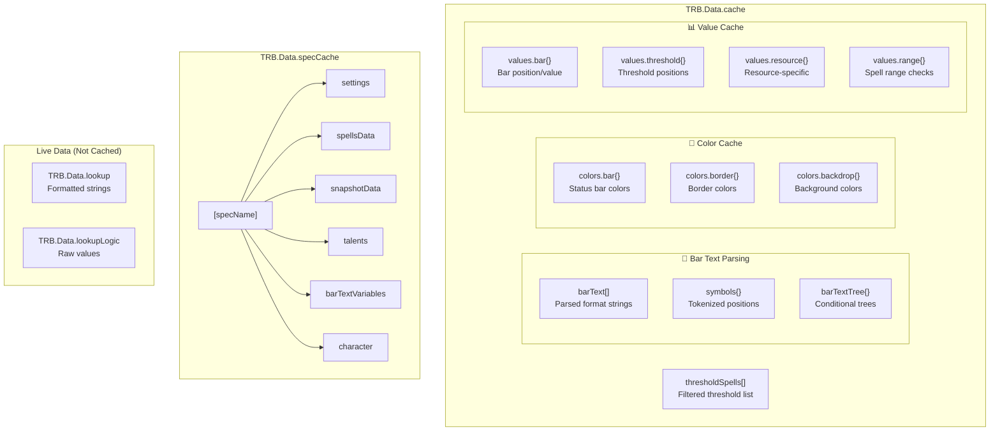
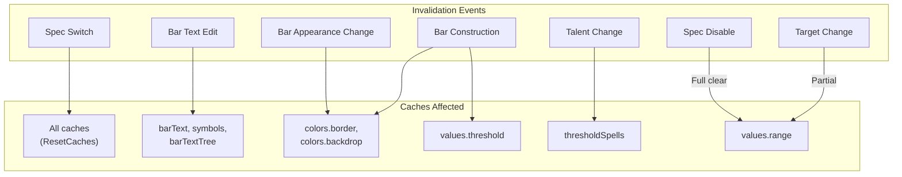
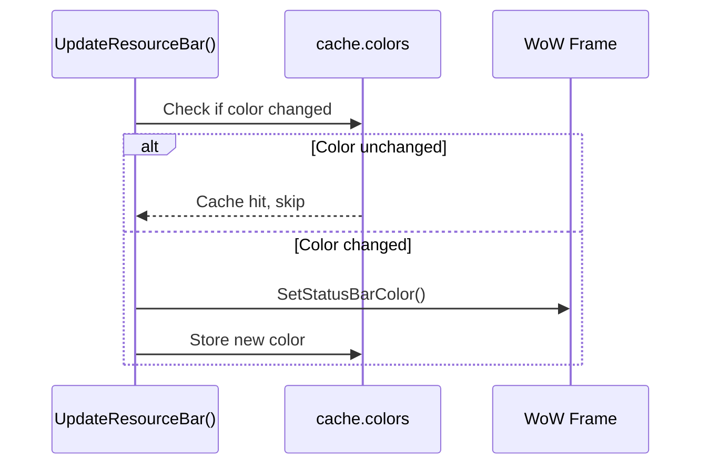

# TwintopInsanityBar Caching Systems

This document provides comprehensive documentation of all caching systems in the TwintopInsanityBar addon.

## Cache Architecture Overview



---

## 1. TRB.Data.cache - Main Runtime Cache

The primary runtime cache for performance optimization. Defined in `Init.lua`.

### 1.1 Bar Text Caches

These three caches work together for bar text processing and are always cleared together.

#### cache.barText

| Property | Value |
|----------|-------|
| **Purpose** | Caches parsed bar text strings with format placeholders for variable substitution |
| **Location** | `TRB.Data.cache.barText = {}` |
| **Population** | `AddToBarTextCache()` in Functions/BarText.lua |
| **Access** | `GetFromBarTextCache()` in Functions/BarText.lua |
| **Structure** | Array of `{ cleanedText, stringFormat, variables[] }` objects |

**Invalidation Points:**
- `ResetCaches()` in Functions/Bar.lua
- Bar text editor `OnTextChanged` in Options/OptionsUi.lua
- Reset defaults in ClassModules/Options/*.lua

#### cache.symbols

| Property | Value |
|----------|-------|
| **Purpose** | Caches tokenized logic symbol positions (e.g., `{`, `}`, `\|`, `&`, `$`) for conditional parsing |
| **Location** | `TRB.Data.cache.symbols = {}` |
| **Population** | `GetFromSymbolsCache()` → `ScanForLogicSymbols()` in Functions/BarText.lua |
| **Access** | `GetFromSymbolsCache(inputString)` |
| **Structure** | `{ [inputString]: { all: [{ position, level, parenthesisLevel, index, symbol }] } }` |

#### cache.barTextTree

| Property | Value |
|----------|-------|
| **Purpose** | Caches parsed conditional tree structures for bar text if/else logic |
| **Location** | `TRB.Data.cache.barTextTree = {}` |
| **Population** | `GetFromBarTextTreeCache()` → `CreateBarTextTree()` in Functions/BarText.lua |
| **Access** | `GetFromBarTextTreeCache(input)` |
| **Structure** | `{ [inputString]: { symbols, barText[], logic, logicVariables[], trueResult, falseResult? } }` |

```mermaid
flowchart LR
    INPUT["Raw bar text"] --> CHECK1{"symbols cache?"}
    CHECK1 -->|"Miss"| SCAN["ScanForLogicSymbols()"]
    SCAN --> STORE1["Store in cache.symbols"]
    CHECK1 -->|"Hit"| SYMBOLS["Use cached symbols"]
    STORE1 --> SYMBOLS
    
    SYMBOLS --> CHECK2{"barTextTree cache?"}
    CHECK2 -->|"Miss"| PARSE["CreateBarTextTree()"]
    PARSE --> STORE2["Store in cache.barTextTree"]
    CHECK2 -->|"Hit"| TREE["Use cached tree"]
    STORE2 --> TREE
    
    TREE --> CHECK3{"barText cache?"}
    CHECK3 -->|"Miss"| ADD["AddToBarTextCache()"]
    ADD --> STORE3["Store in cache.barText"]
    CHECK3 -->|"Hit"| FORMAT["Use cached format"]
    STORE3 --> FORMAT
```



---

### 1.2 Color Caches

Prevent redundant frame color updates for performance.

#### cache.colors.bar

| Property | Value |
|----------|-------|
| **Purpose** | Caches status bar fill colors to skip redundant `SetStatusBarColor()` calls |
| **Location** | `TRB.Data.cache.colors.bar = {}` |
| **Population** | `SetStatusBarColor()` / `SetStatusBarVertexColor()` in Functions/Bar.lua |
| **Access** | Checked before applying color to determine if update is needed |
| **Structure** | `{ [frameKey]: { r, g, b, a } }` |

#### cache.colors.border

| Property | Value |
|----------|-------|
| **Purpose** | Caches frame border colors |
| **Location** | `TRB.Data.cache.colors.border = {}` |
| **Population** | `SetBackdropBorderColor()` in Functions/Bar.lua |
| **Access** | Also accessed in Classes/Bar.lua for BarNode border restoration |
| **Structure** | `{ [frameKey]: { r, g, b, a } }` |

#### cache.colors.backdrop

| Property | Value |
|----------|-------|
| **Purpose** | Caches frame background colors |
| **Location** | `TRB.Data.cache.colors.backdrop = {}` |
| **Population** | `SetBackdropColor()` in Functions/Bar.lua |
| **Structure** | `{ [frameKey]: { r, g, b, a } }` |

**Invalidation Points (all color caches):**
- `ResetCaches()` in Functions/Bar.lua
- `ApplyBarGroupsAppearance()` in Functions/Bar.lua
- `ConstructBarGroups()` in Functions/Bar.lua
- Options panel texture/color changes

---

### 1.3 Value Caches

Prevent redundant frame value updates.

#### cache.values.bar

| Property | Value |
|----------|-------|
| **Purpose** | Caches bar fill values to skip redundant `SetValue()` calls |
| **Location** | `TRB.Data.cache.values.bar = {}` |
| **Population** | `SetBarNodeValue()` in Functions/Bar.lua |
| **Access** | Checked before setting bar value |
| **Structure** | `{ [nodeKey]: { value, maxResource } }` |

#### cache.values.threshold

| Property | Value |
|----------|-------|
| **Purpose** | Caches threshold line positions and icon states |
| **Location** | `TRB.Data.cache.values.threshold = {}` |
| **Population** | `RepositionThreshold()` in Functions/Threshold.lua |
| **Access** | Checked before repositioning thresholds |
| **Structure** | `{ [thresholdKey]: { value, maxResource, icon, texture, iconShown } }` |

**Invalidation Points:**
- `ResetCaches()` in Functions/Bar.lua
- `ApplyBarGroupsLayout()` in Functions/Bar.lua

#### cache.values.resource

| Property | Value |
|----------|-------|
| **Purpose** | Class-specific resource value caching |
| **Location** | `TRB.Data.cache.values.resource = {}` |
| **Population** | Used by class modules for resource-specific caching |
| **Structure** | Varies by class module |

#### cache.values.range

| Property | Value |
|----------|-------|
| **Purpose** | Caches spell range check results for threshold display |
| **Location** | `TRB.Data.cache.values.range = {}` |
| **Population** | `UpdateIsSpellInRange()` in Functions/Threshold.lua, `SpellRangeCheckUpdateEvent()` in Functions/Character.lua |
| **Access** | `GetIsSpellInRange()` in Functions/Threshold.lua |
| **Structure** | `{ [spellId]: boolean }` |

**Invalidation Points:**
- `DisableSpellRangeCheckUpdate()` in Functions/Character.lua

---

### 1.4 Threshold Spells Cache

| Property | Value |
|----------|-------|
| **Purpose** | Caches the filtered list of threshold spells for the current spec/talents |
| **Location** | `TRB.Data.cache.thresholdSpells = {}` |
| **Population** | `GetThresholdSpells()` in Functions/Threshold.lua |
| **Access** | Iterated in class modules' `UpdateResourceBar()` functions |
| **Structure** | `TRB.Classes.SpellThreshold[]` |

**Invalidation Points:**
- Repopulated on talent/spec change via `ResetCaches()`

---

## 2. TRB.Data.specCache - Per-Specialization Cache

Long-lived cache that persists settings and state per specialization. Defined in `Init.lua` as empty table, populated by class modules.

### Structure

Defined via `TRB.Classes.SpecCache` in Classes/SpecCache.lua:

```lua
---@class TRB.Classes.SpecCache
---@field public Global_TwintopResourceBar table
---@field public barTextVariables table       -- { icons = {}, values = {} }
---@field public character table              -- Character-specific state
---@field public settings SpecializationSettingsBase  -- Merged settings
---@field public spellsData TRB.Classes.SpellsData
---@field public snapshotData TRB.Classes.SnapshotData
---@field public talents TRB.Classes.Talents
```

### Properties

| Property | Description |
|----------|-------------|
| `settings` | Merged global + spec-specific settings |
| `spellsData` | Spell definitions and tracking for the spec |
| `snapshotData` | Live state snapshots (buffs, resources, etc.) |
| `talents` | Current talent configuration |
| `barTextVariables` | Variable definitions `{ icons = {}, values = {} }` |
| `character` | Spec-specific character data |
| `Global_TwintopResourceBar` | Reference to saved variables |

### Population Pattern

Each class module creates its specCache in `Setup_[Spec]()`:

```lua
local specCache = {
    discipline = TRB.Classes.SpecCache:New(),
    holy = TRB.Classes.SpecCache:New(),
    shadow = TRB.Classes.SpecCache:New()
}
TRB.Data.specCache = specCache
```

### Access Pattern

```lua
-- Access via spec name
local settings = TRB.Data.specCache[TRB.Data.character.specName].settings

-- Or via LoadFromSpecializationCache()
TRB.Functions.Character:LoadFromSpecializationCache(specCache.shadow)
```

### Settings Merge

`FillSpecializationCacheSettings()` in Functions/Settings.lua merges:
1. Global settings (`TRB.Data.settings.global`)
2. Spec-specific settings
3. Into `specCache.[spec].settings`

### Invalidation

- Recreated on spec switch in `SwitchSpec()`
- Settings re-merged when options change

---

## 3. TRB.Data.lookup / TRB.Data.lookupLogic

**Important:** These are NOT traditional caches - they are **live data tables** rebuilt every frame.

| Table | Purpose | Example |
|-------|---------|---------|
| `lookup` | Formatted strings with color codes | `"$insanity"` → `"\|cFF00FF00150\|r"` |
| `lookupLogic` | Raw numeric values for conditionals | `"$insanity"` → `150` |

### Population

Called every frame by `RefreshLookupData_[Spec]()` in each class module, triggered by `UpdateResourceBarText()`.

### Access

`GetReturnText()` in Functions/BarText.lua uses both tables:
- `lookup` for variable replacement in display text
- `lookupLogic` for conditional evaluation

### Why Not Cached?

Values change constantly (resources, buffs, stats) so caching would be counterproductive.

---

## 4. processedLogicStrings - Conditional Evaluation Cache

Internal cache stored within each bar text tree node.

| Property | Value |
|----------|-------|
| **Purpose** | Caches the result of conditional logic evaluation to avoid redundant `loadstring()` calls |
| **Location** | Stored within each bar text tree node |
| **Population** | `RemoveInvalidVariablesFromBarText()` in Functions/BarText.lua |
| **Access** | Checked before evaluating logic |
| **Values** | `"TRUE"`, `"FALSE"`, `"NONE"`, `"INVALID"` |

**Note:** Caching is skipped for floating-point comparisons (`canCache = false`) since these can change between frames.

**Invalidation:** Cleared when `cache.barTextTree` is cleared.

---

## 5. snapshotData.attributes.cacheRefresh - Stats Refresh Flag

Not a cache itself, but a flag signaling when stat values need to be re-fetched.

| Property | Value |
|----------|-------|
| **Location** | `TRB.Data.snapshotData.attributes.cacheRefresh` |
| **Set to `true`** | `UpdatePrimaryStatsSnapshot()`, `UpdateSecondaryStatsSnapshot()` in Functions/Character.lua, various options panel callbacks |
| **Set to `false`** | After bar text update in Functions/BarText.lua |
| **Check** | `RefreshLookupDataBase()` in Functions/BarText.lua |

### Related Flags

| Flag | Purpose |
|------|---------|
| `attributes.primaryRefresh` | Primary stats (Int/Agi/Str) need update |
| `attributes.secondaryRefresh` | Secondary stats (Haste/Crit/etc.) need update |

---

## 6. Cache Invalidation Summary



### Event → Cache Clearing Matrix

| Event | Caches Cleared |
|-------|----------------|
| **Spec Switch** | All caches via `ResetCaches()` |
| **Bar Text Edit** | `barText`, `symbols`, `barTextTree` |
| **Bar Construction** | `colors.border`, `colors.backdrop`, `values.threshold` |
| **Bar Appearance Change** | `colors.border`, `colors.backdrop` |
| **Talent Change** | `thresholdSpells` |
| **Target Change** | `values.range` (partial - specific spells) |
| **Spec Disable** | `values.range` (full clear) |

---

## 7. ResetCaches() Function

Located in Functions/Bar.lua, this is the primary cache clearing function:

```lua
function TRB.Functions.Bar:ResetCaches()
    TRB.Data.cache = {
        barText = {},
        symbols = {},
        barTextTree = {},
        colors = {
            bar = {},
            border = {},
            backdrop = {}
        },
        values = {
            bar = {},
            threshold = {},
            resource = {},
            range = {}
        },
        thresholdSpells = {}
    }
end
```

### When ResetCaches() is Called

1. **Spec Switch** - `SwitchSpec()` in each class module
2. **Bar Construction** - `ConstructResourceBar()` in each class module
3. **Options Apply** - When settings change requires full refresh
4. **Reset Defaults** - When user resets to default settings

---

## 8. Performance Considerations

### Why These Caches Exist

| Cache Type | Problem Solved |
|------------|----------------|
| **barText** | Parsing bar text strings is expensive; cache the parsed format |
| **colors** | Frame color updates cause GPU work; skip if unchanged |
| **values** | Frame value updates cause layout recalc; skip if unchanged |
| **thresholdSpells** | Filtering spells by talent is expensive; cache the result |
| **range** | Spell range checks are API calls; cache the result |

### Cache Hit Patterns



### Memory vs CPU Tradeoff

- **Bar text caches** can grow large with many unique strings
- **Color/value caches** are bounded by number of frames
- Trade memory for CPU cycles (avoid redundant parsing/updates)
